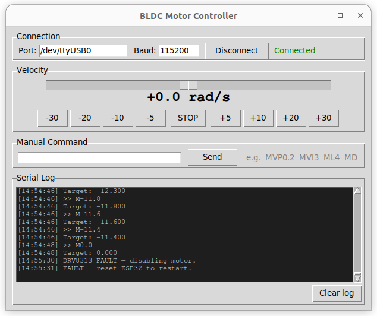

English | [中文](README_zh.md)

# BLDC Motor Test

Closed-loop FOC velocity control for a 2804 BLDC motor using an ESP32, DRV8313 driver board, and MT6701 magnetic encoder (ABZ mode). Includes a Python UI with a velocity slider for real-time testing.

Built with [SimpleFOC 2.3.3](https://simplefoc.com) and [PlatformIO](https://platformio.org).

---

## Where to Buy

| Component | Taobao | AliExpress | Amazon |
|-----------|--------|------------|--------|
| SimpleFOC Mini (DRV8313) | [Taobao](https://item.taobao.com/item.htm?id=837317616752&mi_id=0000YVGEu30zyA7Uvs_Vt62DVpf9Zm-6USKcl3YBk9A2ByE&spm=tbpc.boughtlist.suborder_itemtitle.1.67e02e8d5bJByI) | [AliExpress](https://www.aliexpress.com/item/1005005137437532.html) | [Amazon](https://www.amazon.com/dp/B0GDW57QXS) |
| 2805 motor + MT6701 encoder | [Taobao](https://item.taobao.com/item.htm?id=643573104607&mi_id=000004adwHpYAu8ZHWrjlCJiLuOUTJfm-yCR4iu7k9HKmOw&spm=tbpc.boughtlist.suborder_itemtitle.1.67e02e8d5bJByI) | [AliExpress](https://www.aliexpress.com/item/3256808634709468.html) | [Amazon](https://www.amazon.com/Brushless-Outrunner-Magnetic-SimpleFOC-Supported/dp/B0GJCJKPQP) |
| ESP32 Dev Module | — | [AliExpress](https://www.aliexpress.com/item/32790946216.html) | [Amazon](https://www.amazon.com/AITRIP-ESP-WROOM-32-Development-Bluetooth-ESP32-DevKitC-32/dp/B0BHWP2628) |

---

## Hardware Required

| Component | Details |
|-----------|---------|
| ESP32 Dev Module | Any standard ESP32 dev board |
| DRV8313 motor driver | SimpleFOCMini or equivalent 3-phase driver |
| MT6701 magnetic encoder | Must be configured for ABZ output mode |
| 2804 BLDC motor | 12N14P winding, 7 pole pairs |
| 12V power supply | Powers the motor driver (separate from USB) |

---

## Wiring

### Power

The ESP32 is powered by USB. The motor driver needs a **separate 12V supply** connected to its VM/PVDD pin. Both must share a common GND.

### ESP32 to DRV8313 (Motor Driver)

| ESP32 | DRV8313 | Notes |
|-------|---------|-------|
| GPIO 25 | IN1 | Phase A PWM |
| GPIO 26 | IN2 | Phase B PWM |
| GPIO 27 | IN3 | Phase C PWM |
| GPIO 14 | EN | Driver enable |
| GPIO 4 | nFT | Fault signal (input) |
| 3.3V | VCC | Logic power |
| GND | GND | Common ground |

The nFT pin is open-drain. GPIO 4 has an internal pull-up enabled in firmware — no external resistor needed.

### ESP32 to MT6701 (Encoder)

| ESP32 | MT6701 | Notes |
|-------|--------|-------|
| GPIO 19 | A | Encoder channel A |
| GPIO 18 | B | Encoder channel B |
| GPIO 5 | Z | Index pulse |
| 3.3V | VDD | Sensor power |
| GND | GND | Common ground |

The default PPR (pulses per revolution) is set to **1024** in `src/main.cpp`. Change this if your MT6701 is configured for a different resolution.

---

## Software Setup

**1. Install PlatformIO**

Follow the instructions at [platformio.org](https://platformio.org) for CLI or the VS Code extension.

**2. Install Python dependencies (for the UI)**

```bash
pip install pyserial
```

`tkinter` is included with most Python 3 installations. If it is missing, install it via your system package manager (e.g. `sudo apt install python3-tk` on Ubuntu).

---

## Flash the Firmware

Connect the ESP32 via USB, then run:

```bash
# Compile only
pio run

# Compile and flash
pio run --target upload
```

**Find your serial port:**
- Linux: `/dev/ttyUSB0` or `/dev/ttyUSB1`
- macOS: `/dev/cu.usbserial-XXXX`
- Windows: `COM3`, `COM4`, etc.

Edit `platformio.ini` and set `upload_port` and `monitor_port` to match your device.

---

## First Boot

On every boot or reset, the ESP32 runs an automatic FOC alignment. During this phase the motor will briefly twitch and rotate slowly — this is normal. It typically takes **5 to 10 seconds**.

Watch the serial output. When you see:

```
MOT: PP check: OK!
MOT: Ready.
```

the motor is aligned and ready to receive velocity commands.

To reset at any time, press the **EN** button on the ESP32 board.

---

## Motor UI



Launch the graphical control panel:

```bash
python3 motor_ui.py
```

**Steps:**
1. Set the port field to match your device
2. Click **Connect**
3. Wait for `MOT: Ready.` to appear in the serial log
4. Drag the velocity slider or press a quick-set button

The slider range is **-50 to +50 rad/s**. Positive values spin forward, negative spin in reverse. The region within +/-0.5 rad/s snaps to zero (stop).

---

## Serial Commands

Commands can be typed in the UI manual command box or sent from any serial terminal at **115200 baud**. The motor prefix is `M`.

| Command | Action |
|---------|--------|
| `M5` | Spin at 5 rad/s |
| `M-5` | Spin at -5 rad/s (reverse) |
| `M0` | Stop |
| `MVP0.2` | Set velocity PID P gain to 0.2 |
| `MVI3` | Set velocity PID I gain to 3 |
| `MVD0` | Set velocity PID D gain to 0 |
| `ML4` | Set voltage limit to 4V |
| `MD` | Print current motor status |
| `ME0` | Disable motor |
| `ME1` | Re-enable motor |

---

## Troubleshooting

**Motor does not move after Ready**
- Check that 12V is connected to the driver VM/PVDD pin.
- Try increasing the voltage limit with `ML6` in the serial command box.

**FOC alignment fails or hangs**
- Verify the encoder A, B, Z wires are connected correctly.
- The motor must be free to rotate during alignment — remove any load.

**Upload fails with port error**
- Check that no other program (serial monitor, UI) is holding the port open.
- Click Disconnect in the UI before flashing.

**Encoder reads 0.00 at all times**
- Check that the MT6701 is in ABZ mode, not SPI mode.
- Verify the A and B wires are connected and not swapped.

---

## Notes

- **SimpleFOC 2.3.3 is pinned** — version 2.4.0 and above requires ESP-IDF 5.x, which is incompatible with the current toolchain. Do not change the version in `platformio.ini` without also updating the platform.
- **voltage_limit is set to 4V** — conservative for this motor (Rs = 2.55 ohm, ~1.6A peak). Increase gradually with the `ML` command when tuning.
- **GPIO 35 is not used for the fault pin** — GPIO 34/35/36/39 on ESP32 are input-only and do not support internal pull-ups. The fault pin is on GPIO 4 instead.

---

## Why Not Arduino UNO — FOC Loop Rate

Arduino UNO is often used in beginner FOC projects but causes serious motor stutter at higher speeds. Here is why:

| | Arduino UNO | ESP32 (this project) |
|-|-------------|----------------------|
| Clock speed | 16 MHz | 240 MHz |
| Typical FOC loop rate | 800 – 1500 Hz | 10,000 – 20,000 Hz |
| Minimum recommended rate | > 5000 Hz | > 5000 Hz |

**Why loop rate matters for this motor:**

At the rated speed of 2600 RPM with 7 pole pairs:

```
Electrical frequency = (2600 / 60) × 7 = 303 Hz
Minimum FOC loop rate = 303 × 10 = ~3000 Hz
```

The UNO barely reaches 1500 Hz, which is below the minimum needed. The result is timing errors, jerky rotation, and loss of torque at higher speeds.

**ESP32 at 240 MHz easily sustains 10,000+ Hz**, giving clean and stable FOC control across the full speed range. If you experience stutter on another platform, check the FOC loop rate first — it is the most commonly overlooked cause.

Recommended alternatives to UNO: **ESP32**, STM32 Nucleo, Teensy 4.x.

---

## MT6701 Output Modes

The MT6701 ships in **ABZ mode by default**. It supports four output protocols, each suited to different use cases:

| Mode | Signal type | Wires needed | Pros | Cons |
|------|-------------|--------------|------|------|
| **ABZ** *(default)* | Incremental quadrature + index | A, B, Z | Simple, works with any MCU interrupt | No absolute position on power-up, needs index search |
| **SPI** | Digital serial (SSI) | CS, CLK, MISO | Absolute position, high resolution (14-bit) | Requires SPI bus, slightly more wiring |
| **UVW** | 3-phase commutation signals | U, V, W | Direct input to some motor drivers | Low resolution, limited to commutation only |
| **PWM** | Single-wire pulse width | 1 wire | Fewest wires | Slow update rate, lower accuracy |

**This project uses ABZ** because the MT6701 ships in this mode out of the box and no reconfiguration is needed. The index (Z) pulse allows SimpleFOC to find the absolute zero reference on startup, which is why the motor briefly rotates during the alignment phase.

To switch output mode, the MT6701 must be reprogrammed via its I2C configuration interface using its EEPROM registers. Refer to the [MT6701 datasheet](https://www.magntek.com.cn/upload/MT6701_Rev.1.8.pdf) for details.
